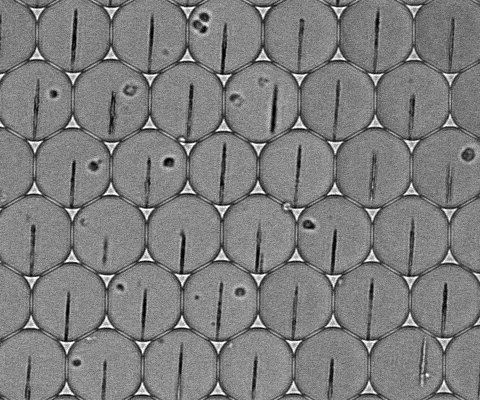
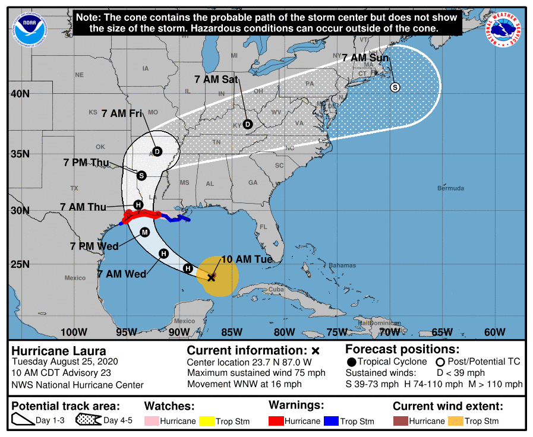
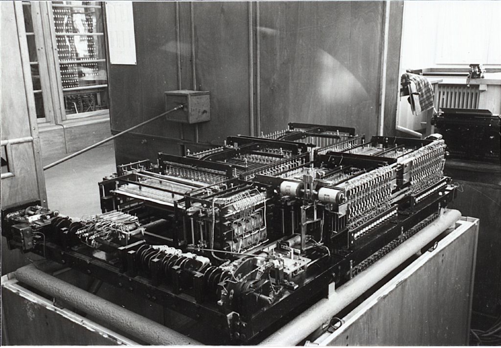

# Data Science Lab

## About DSL

In this class, we bring together data science applications
provided by domain experts and
teams of data science master's students. Three to Four
students will form a team working on data science/machine
learning-related research topics provided by scientists in
a diverse range of domains such as astronomy, biology,
social sciences etc.

The goal of this class if for students to gain experience
of dealing with data science and machine learning applications
"in the wild". Students are expected to go through the full
process starting from data cleaning, modeling, execution,
debugging, error analysis, and quality/performance refinement.

## Lecturers 

- Valentina Boeva
- Ryan Cotterell
- Julia Vogt
- Fan Yang
- Ce Zhang

General inquiry: Ce Zhang (ce.zhang@inf.ethz.ch)

## Logistics

- Week 1 (Sep 23rd, 2021) 2pm-4pm: Presentation from experts about projects and data
- Biweekly meeting with computer science professors
- Biweekly meeting with experts

## Projects

This semester we have an amazing collection of experts from six different departments at 
ETH (D-CHAB, D-GESS, D-ITET, D-BIOL, D-USYS, D-MTECH), together with experts from University of Zurich, 
Stanford University, EMPA, Restor, ETH IT and ETH Library.

### 1. PROJECT TITLE (Burden Andrea; D-CHAB)

DESCRIPTION OF PROJECT DESCRIPTION OF PROJECT DESCRIPTION OF PROJECT DESCRIPTION OF PROJECT
DESCRIPTION OF PROJECT DESCRIPTION OF PROJECT DESCRIPTION OF PROJECT DESCRIPTION OF PROJECT
DESCRIPTION OF PROJECT DESCRIPTION OF PROJECT DESCRIPTION OF PROJECT DESCRIPTION OF PROJECT
DESCRIPTION OF PROJECT DESCRIPTION OF PROJECT DESCRIPTION OF PROJECT DESCRIPTION OF PROJECT
DESCRIPTION OF PROJECT DESCRIPTION OF PROJECT DESCRIPTION OF PROJECT DESCRIPTION OF PROJECT
DESCRIPTION OF PROJECT DESCRIPTION OF PROJECT DESCRIPTION OF PROJECT DESCRIPTION OF PROJECT
DESCRIPTION OF PROJECT DESCRIPTION OF PROJECT DESCRIPTION OF PROJECT DESCRIPTION OF PROJECT
DESCRIPTION OF PROJECT DESCRIPTION OF PROJECT DESCRIPTION OF PROJECT DESCRIPTION OF PROJECT
DESCRIPTION OF PROJECT DESCRIPTION OF PROJECT DESCRIPTION OF PROJECT DESCRIPTION OF PROJECT
 

### 2. PROJECT TITLE (Elliott Ash; D-GESS)

DESCRIPTION OF PROJECT DESCRIPTION OF PROJECT DESCRIPTION OF PROJECT DESCRIPTION OF PROJECT
DESCRIPTION OF PROJECT DESCRIPTION OF PROJECT DESCRIPTION OF PROJECT DESCRIPTION OF PROJECT
DESCRIPTION OF PROJECT DESCRIPTION OF PROJECT DESCRIPTION OF PROJECT DESCRIPTION OF PROJECT
DESCRIPTION OF PROJECT DESCRIPTION OF PROJECT DESCRIPTION OF PROJECT DESCRIPTION OF PROJECT
DESCRIPTION OF PROJECT DESCRIPTION OF PROJECT DESCRIPTION OF PROJECT DESCRIPTION OF PROJECT
DESCRIPTION OF PROJECT DESCRIPTION OF PROJECT DESCRIPTION OF PROJECT DESCRIPTION OF PROJECT
DESCRIPTION OF PROJECT DESCRIPTION OF PROJECT DESCRIPTION OF PROJECT DESCRIPTION OF PROJECT
DESCRIPTION OF PROJECT DESCRIPTION OF PROJECT DESCRIPTION OF PROJECT DESCRIPTION OF PROJECT
DESCRIPTION OF PROJECT DESCRIPTION OF PROJECT DESCRIPTION OF PROJECT DESCRIPTION OF PROJECT
 

### 3. PROJECT TITLE (Helmut Bölcskei; D-ITET)

DESCRIPTION OF PROJECT DESCRIPTION OF PROJECT DESCRIPTION OF PROJECT DESCRIPTION OF PROJECT
DESCRIPTION OF PROJECT DESCRIPTION OF PROJECT DESCRIPTION OF PROJECT DESCRIPTION OF PROJECT
DESCRIPTION OF PROJECT DESCRIPTION OF PROJECT DESCRIPTION OF PROJECT DESCRIPTION OF PROJECT
DESCRIPTION OF PROJECT DESCRIPTION OF PROJECT DESCRIPTION OF PROJECT DESCRIPTION OF PROJECT
DESCRIPTION OF PROJECT DESCRIPTION OF PROJECT DESCRIPTION OF PROJECT DESCRIPTION OF PROJECT
DESCRIPTION OF PROJECT DESCRIPTION OF PROJECT DESCRIPTION OF PROJECT DESCRIPTION OF PROJECT
DESCRIPTION OF PROJECT DESCRIPTION OF PROJECT DESCRIPTION OF PROJECT DESCRIPTION OF PROJECT
DESCRIPTION OF PROJECT DESCRIPTION OF PROJECT DESCRIPTION OF PROJECT DESCRIPTION OF PROJECT
DESCRIPTION OF PROJECT DESCRIPTION OF PROJECT DESCRIPTION OF PROJECT DESCRIPTION OF PROJECT
 

### 4. PROJECT TITLE (Daniel Boschung; D-BIOL)

BeePollenTracker is a project from BeeLivingSensor. It is using the 30 000 to 50 000 honeybees from a colony as living sensors  for the colony's health and environmental change. With AI we count the incoming bees and detect the amount and color of pollen, which gives us some information about the biodiversity in the flying radius of the bees.  Furthermore, the project will connect different stakeholders including beekeepers, farmers, scientists, schools, citizen scientists, etc to bring together their expertise, as well as data sources from the hives like weights, temperatures, humidity (inside and outside the hive). The aggregated data will be visualized and openly available so to get informed about the bees health, surrounding biodiversity and environmental change.

Project Aims: Count and detect the color of pollen honeybees are bringing to the hive in a noninvasive way.
Building an IT platform which allows sharing and aggregating honeybee related data. 
Integrating Citizen Science to the project and connecting all the different stakeholders. 
 

### 5. PROJECT TITLE (Paul Cross; ETH IT)

DESCRIPTION OF PROJECT DESCRIPTION OF PROJECT DESCRIPTION OF PROJECT DESCRIPTION OF PROJECT
DESCRIPTION OF PROJECT DESCRIPTION OF PROJECT DESCRIPTION OF PROJECT DESCRIPTION OF PROJECT
DESCRIPTION OF PROJECT DESCRIPTION OF PROJECT DESCRIPTION OF PROJECT DESCRIPTION OF PROJECT
DESCRIPTION OF PROJECT DESCRIPTION OF PROJECT DESCRIPTION OF PROJECT DESCRIPTION OF PROJECT
DESCRIPTION OF PROJECT DESCRIPTION OF PROJECT DESCRIPTION OF PROJECT DESCRIPTION OF PROJECT
DESCRIPTION OF PROJECT DESCRIPTION OF PROJECT DESCRIPTION OF PROJECT DESCRIPTION OF PROJECT
DESCRIPTION OF PROJECT DESCRIPTION OF PROJECT DESCRIPTION OF PROJECT DESCRIPTION OF PROJECT
DESCRIPTION OF PROJECT DESCRIPTION OF PROJECT DESCRIPTION OF PROJECT DESCRIPTION OF PROJECT
DESCRIPTION OF PROJECT DESCRIPTION OF PROJECT DESCRIPTION OF PROJECT DESCRIPTION OF PROJECT
 

### 6. Next-generation deep-phenotyping of individual, functionally active cells (Klaus Eyer; D-CHAB)

Vaccines have had and continue to have a tremendously
positive effect on global health. Preventive in their action,
they can protect recipients from specific diseases due to
the induced immunological response. Vaccine-mediated
protection can often be linked directly to generating
specific antibody repertoire such as neutralizing
antibody-producing cells. Long-term protection is
achieved due to the continued presence of these cells
within the organism and the development of
immunological memory. Today, we usually assess
protection in serum but the presence of &gt;10 3 different
antibodies makes quantification and the extracting of additional biological understanding
thereof tricky. In this regard, my research group develops novel technologies and analytical
strategies to quantify vaccine-mediated protection on the single-antibody level. In this effort,
we aim to understand protection itself better and predict the duration of protection in
individuals.

This project will work on data generated using a murine model system and a novel
immunization approach for severe acute respiratory syndrome coronavirus type 2 (SARS-
CoV-2). In these projects, we compartmentalize individual cells in monodisperse 50 pL
aqueous droplets by using droplet microfluidics, and measure the frequency of producing
cells, production rates, the specificity of the produced antibody and whether the antibody is
able to induce biologically-relevant functions such as neutralization. We have developed an
image-based read-out based on microscopic brightfield and fluorescent images. In this
collaboration, we would be interested in reading out additional parameters from our images,
mainly on the bright field images, such as cell size, ‘stickiness of the cells, granularity, or
other characteristics, in addition to our classical analysis. These additional parameters are of
great interest to us since they will better define the immensely heterogonous population of
antibody secreting cells and B cells in general. Within the immense cellular heterogeneity
found in B cells (antibody-producing cells are a subset of B cells) also lies the challenge of
this project since cells can display many different features, features that can be used to
identify the cells.
 

### 7. PROJECT TITLE (Nicolas Langer; UZH)

Assessing where a person looks while recording brain activity non-invasively with functional magnetic resonance imaging (fMRI) or electroencephalography (EEG) provides a powerful behavioral measure that can be used to address many different research questions in cognitive neuroscience and psychology. While to date, gaze information are predominantly being used to identify a participant’s variations in attention, arousal, and their overall compliance with the task, it will become an ever more important measure in light of the emerging trend of employing more naturalistic experimental paradigms (such as movie watching) to increase the ecological validity of research findings. 
However, up to now the cost of eye-tracking hardware and the complex setup requirements of current eye-tracking solutions preclude many researchers from collecting gaze information. Consequently, recent studies have focused on leveraging advanced machine-learning techniques to compute gaze position based on images from webcams or fMRI signals. Using a webcam to estimate gaze position though requires an additional system and sophisticated synchronization with auxiliary measurements from the actual experiment that is even more cumbersome than traditional eye-tracking systems. Moreover, fMRI data acquisition is costly and does not provide temporal resolution at the speed at which cognition actually occurs. In contrast, EEG is a widely- used, safe, and cost-friendly method that directly measures the electrical activity of the brain and enables measurement over prolonged time periods in clinical settings. However, an eye-tracking approach that estimates gaze position from concurrently measured EEG and electrooculography EOG (EEG-EOG) is currently lacking. 
In this proposal, we address this shortcoming and hypothesize that gaze position can be reliably extracted from combined EEG and EOG activity using state-of-the-art machine learning, in particular deep learning. We propose two subprojects to pursue this endeavor. In subproject A, we will use an existing and in-house collected dataset of 390 healthy participants engaging in cognitive tasks of varying complexity. This unique dataset consists of EEG/EOG recordings with concurrent infrared video-based eye- tracking for over 2.5 million gaze fixations and helps us to overcome the major challenge for any deep-learning project: collecting enough labelled training data. Using this dataset, we will train a deep convolutional neural network to learn the unique patterns of EEG/EOG activity that are associated with different gaze positions on the screen. The aim of subproject B is to evaluate the trained convolutional neural network derived from subproject A with completely independent data from new subjects. Our proposed project will result in the development of a freely and publicly available open-source toolbox that will provide EEG research and clinical institutions worldwide with a tool to objectively, reliably and time-efficiently assess gaze position without any knowledge required of data analysis or any additional costs to their existing infrastructure. 
 

### 8. Data-centric AI for computer vison (Mirko Lukovic; EMPA)

One of the missions of the **WoodTec** group is to improve automation in the wood industry through AI. In particular, we have one running project where we want to determine the tree species and mechanical properties of wood samples from images. We have two labelled datasets: HD photographs of standardized wood lamellae and microscale tomograms of small wood samples (see figure on the left). The problem is that they are rather small and imbal-anced. For this reason, we want to focus specifically on **data-centric** AI by including data modification and augmentation as part of the learning process. The questions is the following: having chosen a reasonable CNN architecture, what can we do with the available data in order to improve the learning process?
 

### 9. (Sebastian Schemm; D-USYS)

Accurately predicted cyclones tracks are important
for containing weather related socio-economic risks.
Even on daily and hourly time scales, cyclone tracks are associated with large uncertainties, as
indicated, for example, by the probability cone in the attached figure. These great uncertainties
are a challenge for emergency planning and the implementation of disaster risk reduction.The aim of this project is to develop an ML method that
is able to predict the future cyclones path given
information about the past track and current
environmental conditions (e.g. wind in the
Environment on different levels). This project builds on the work that started during last year’s data science lab.

 

### 10. (Daniella Schweizer; Restor)

Restor is a newly created platform that aims to bring transparency, connectivity and ecological insights to restoration efforts around the world. As part of this initiative, we have embarked in a project, in collaboration with Dr. Ce Zhang, where we want to explore the application of machine learning methods for the automatic detection of tree crowns from high resolution aerial images. The automatic detection of tree crowns can enable forest restoration practitioners and funders to evaluate several indicators of restoration health, forest tree structural diversity, canopy density and canopy closeness, which are important for the evaluation of restoration progress and will improve the transparency as more and more stakeholders get engaged in trying to scale up the efforts for restoring degraded forest areas and other ecosystems. We hope you get excited about this project and want to help us in deriving the mentioned algorithms! 
 

### 11. Historical Image Recognition(Christiane Sibille; ETH Library)

ETH Library's Image Archive (https://ba.e-pics.ethz.ch) provides access to around 550,000 digitised photographs. These images document in particular the history of research at ETH, but also includes a wide range of other topics (e.g. [here](https://ba.e-pics.ethz.ch/catalog/ETHBIB.Bildarchiv/r/46/viewmode=infoview), [here](https://ba.e-pics.ethz.ch/catalog/ETHBIB.Bildarchiv/r/45073/viewmode=infoview) or [here](https://ba.e-pics.ethz.ch/catalog/ETHBIB.Bildarchiv/r/40391/viewmode=infoview) ). All images are manually indexed and most of them are also automatically tagged. However, the results for tagged historical images do not seem to be very accurate yet. 
With this project you can contribute to the improvement of the recognition of historical images. In a first step, we would be very interested in a deeper understanding of the existing tagging. Are there systematic errors and how can we improve the recognition? 
The aim of the project is the creation of an application with which we will be able to train a model for tagging historical images and apply it to our and similar collections.
 

### 12. PROJECT TITLE (Benjamin Stocker; D-USYS)

DESCRIPTION OF PROJECT DESCRIPTION OF PROJECT DESCRIPTION OF PROJECT DESCRIPTION OF PROJECT
DESCRIPTION OF PROJECT DESCRIPTION OF PROJECT DESCRIPTION OF PROJECT DESCRIPTION OF PROJECT
DESCRIPTION OF PROJECT DESCRIPTION OF PROJECT DESCRIPTION OF PROJECT DESCRIPTION OF PROJECT
DESCRIPTION OF PROJECT DESCRIPTION OF PROJECT DESCRIPTION OF PROJECT DESCRIPTION OF PROJECT
DESCRIPTION OF PROJECT DESCRIPTION OF PROJECT DESCRIPTION OF PROJECT DESCRIPTION OF PROJECT
DESCRIPTION OF PROJECT DESCRIPTION OF PROJECT DESCRIPTION OF PROJECT DESCRIPTION OF PROJECT
DESCRIPTION OF PROJECT DESCRIPTION OF PROJECT DESCRIPTION OF PROJECT DESCRIPTION OF PROJECT
DESCRIPTION OF PROJECT DESCRIPTION OF PROJECT DESCRIPTION OF PROJECT DESCRIPTION OF PROJECT
DESCRIPTION OF PROJECT DESCRIPTION OF PROJECT DESCRIPTION OF PROJECT DESCRIPTION OF PROJECT
 

### 13. PROJECT TITLE (Yash Shrestha; D-MTECH; Bibek Paudel; Stanford University)

DESCRIPTION OF PROJECT DESCRIPTION OF PROJECT DESCRIPTION OF PROJECT DESCRIPTION OF PROJECT
DESCRIPTION OF PROJECT DESCRIPTION OF PROJECT DESCRIPTION OF PROJECT DESCRIPTION OF PROJECT
DESCRIPTION OF PROJECT DESCRIPTION OF PROJECT DESCRIPTION OF PROJECT DESCRIPTION OF PROJECT
DESCRIPTION OF PROJECT DESCRIPTION OF PROJECT DESCRIPTION OF PROJECT DESCRIPTION OF PROJECT
DESCRIPTION OF PROJECT DESCRIPTION OF PROJECT DESCRIPTION OF PROJECT DESCRIPTION OF PROJECT
DESCRIPTION OF PROJECT DESCRIPTION OF PROJECT DESCRIPTION OF PROJECT DESCRIPTION OF PROJECT
DESCRIPTION OF PROJECT DESCRIPTION OF PROJECT DESCRIPTION OF PROJECT DESCRIPTION OF PROJECT
DESCRIPTION OF PROJECT DESCRIPTION OF PROJECT DESCRIPTION OF PROJECT DESCRIPTION OF PROJECT
DESCRIPTION OF PROJECT DESCRIPTION OF PROJECT DESCRIPTION OF PROJECT DESCRIPTION OF PROJECT
 

### 14. Field-based wheat growth monitoring with RGB time series (Achim Walter, Lukas Roth; D-USYS)

In the last seven years, the <a href="https://kp.ethz.ch/infrastructure/FIP.html">field phenotyping platform (FIP)</a> at ETH constantly collected image time series of more than 350 wheat genotypes. This dataset promises to provide new insights of growth dynamics in relation to the environment, an essential prerequisite for adapting field crops to a changing climate.

Monitoring plant and shoot growth dynamics in early spring is a challenging task: Baseline methods exist to estimate image homographies on time series, to semantically segment images in pixels showing plant and soil, and to extract plant and shoot count estimations. Nevertheless, some steps in this workflow are based on hand-crafted algorithms, and other require intense manual input.

In this project, you have the task to replace certain steps in this workflow with state-of-the-art deep learning algorithm. For the image homography step, large training sets exist. A labeled training set for plant and shoot counts exists as well, but its quality is due to its nature limited (it is very hard to count tiny plants outside in cold spring). Enhancing the training set with synthetic data generated with a functional-structural plant growth model (e.g., <a href="https://www.quantitative-plant.org/model/AdelWheat">ADEL-Wheat</a>) may represent one option to enhance the training set. Using the time series character of the collected images represents another alternative.
 

